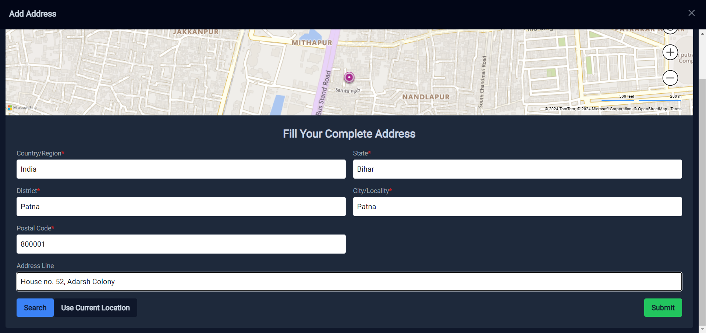
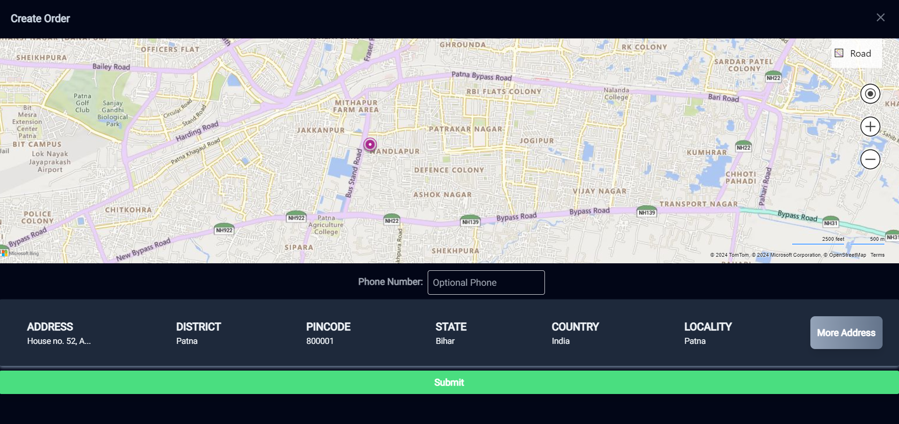
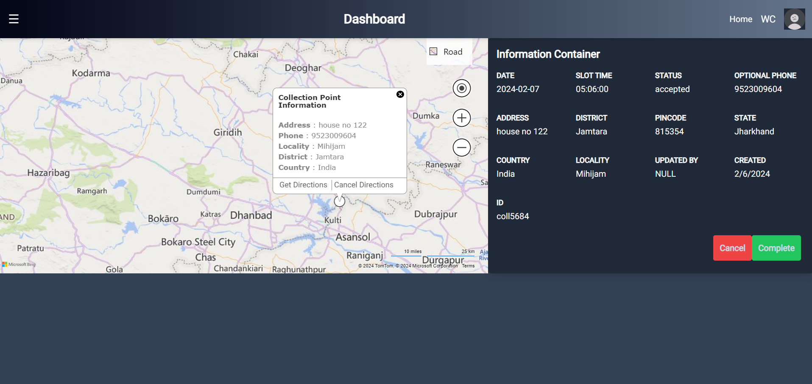
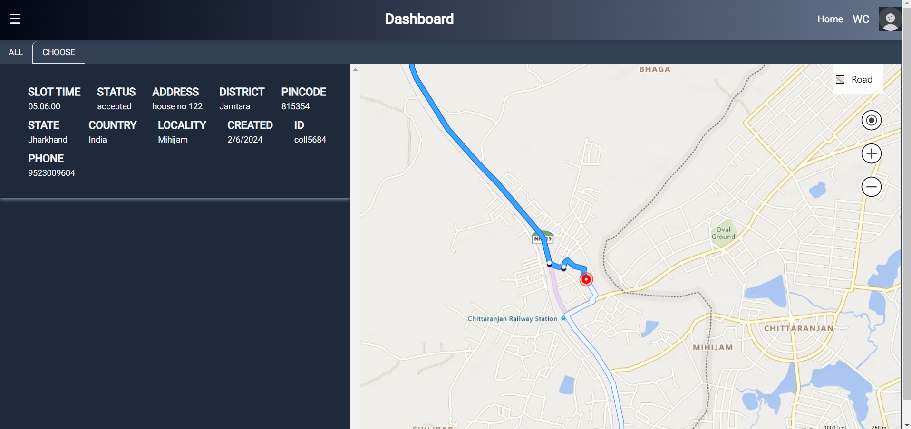

# WasteTrade

## Overview

WasteTrade is an innovative application designed to streamline the process of trading recyclable materials. It connects customers with waste collectors through a user-friendly interface, integrated maps, and an efficient matching system. The goal is to promote recycling, reduce waste, and contribute to environmental sustainability.

## Problem Statement

In the current landscape, trading recyclable materials is fraught with inefficiencies and inconveniences. Customers struggle to find reliable waste collectors and arrange pickups, while collectors face challenges in locating and coordinating with potential customers. This disconnect leads to missed recycling opportunities, increased waste, and negative environmental impacts.

## Solution

WasteTrade offers a comprehensive solution to these challenges:

1. **User-Friendly Interface**: Simplifies the process for customers to list and sell recyclable materials.
2. **Integrated Maps and Directions**: Provides accurate location pinpointing with 95% accuracy, making it easy for waste collectors to reach the pickup locations.
3. **Efficient Matching System**: Connects customers with local waste collectors, ensuring timely and efficient pickups.
4. **Environmental Impact**: Encourages recycling, reduces waste, and supports sustainable practices.

## Features

- **List Recyclable Materials**: Customers can easily list metals, plastics, wood, and other recyclable materials for sale.
- **Integrated Mapping**: Accurate maps and directions for pinpointing preferred pickup locations.
- **Matchmaking System**: Efficiently matches customers with nearby waste collectors.
- **User Notifications**: Real-time updates and notifications for both customers and collectors regarding the status of pickups.

## Getting Started

### Prerequisites

- Django
- NextJs
- BingMaps

### Installation

1. Clone the repository:
    ```sh
    git clone https://github.com/AKSourav/WasteManagement.Web.git
    ```
2. Navigate to the project directory:
    ```sh
    cd WasteManagement.Web
    ```
3. Run Docker Compose:
    ```sh
    docker-compose up
    ```

### WEBSITE






### Usage

1. Register an account or log in.
2. List your recyclable materials or browse available listings.
3. Use the integrated map to specify your preferred pickup location.
4. Receive notifications and updates on the status of your pickup.

## Links

- [GitHub Repository](https://github.com/AKSourav/WasteManagement.Web)
- [Website](wastemanagementweb.onrender.com/)
